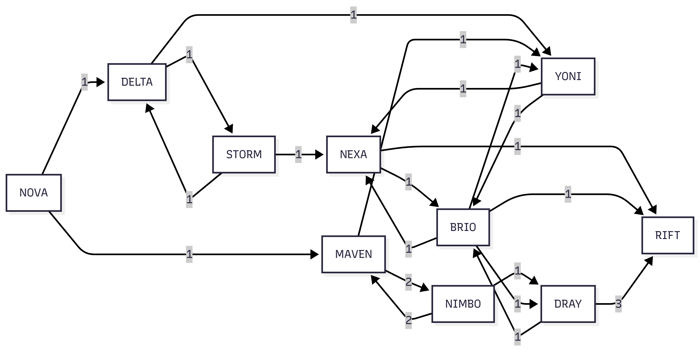

# Task 1

# Task 2

# User Manual – Adding a Mule to the Picture Using AI

This manual explains how I used AI tools to add a realistic mule to the provided image. I signed in to ChatGPT and used Google Gemini to perform the image editing.

---

## Step 1 – Sign in to ChatGPT

1. Open **https://chatgpt.com**.
2. Click **Log in** or **Sign up** if you do not already have an account.
3. Sign in using your email address, Google account, or Microsoft account.
4. After logging in, the ChatGPT home page will appear.

---

## Step 2 – Open ChatGPT

After signing in, open a new chat where you can ask questions or get help with prompts for image editing.

---

## Step 3 – Upload the Original Image

Download the provided template image and keep it ready for editing.

Original image:

---

## Step 4 – Edit the Image with Google Gemini

1. Open **Google Gemini**.
2. Upload the original template image.
3. Enter the following prompt:

> Add a realistic mule to this image. Keep everything else unchanged. Match the lighting, perspective, and shadows so it looks natural.

4. Wait for Gemini to generate the edited image.

---

## Step 5 – Download the Result

After the image is generated, download it and save it to your computer.

Final edited image:

---

## Result

The AI successfully added a realistic mule while preserving the original landscape, lighting, colors, shadows, and perspective. The edited image looks natural and satisfies the requirements of the task.

# Task 3

